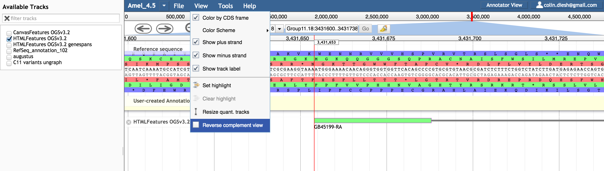
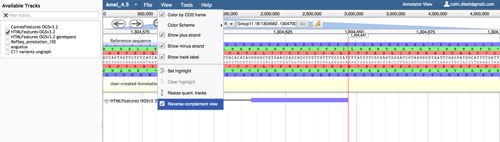
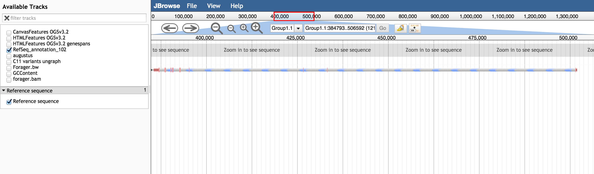
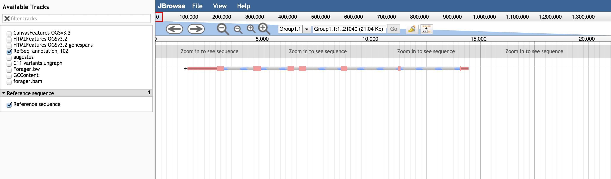

# projectionplugin

A JBrowse plugin for re-mapping coordinates "on the fly"

## Options

* storeClass - The projections are implemented as store classes which depend on the data types. This plugin currently allows:
  * reverse projections
    * ProjectionPlugin/Store/SeqFeature/ReverseSequence
    * ProjectionPlugin/Store/SeqFeature/ReverseNCList
    * ProjectionPlugin/Store/SeqFeature/ReverseBigWig
    * ProjectionPlugin/Store/SeqFeature/ReverseBAM
  * "folded" regions
    * ProjectionPlugin/Store/SeqFeature/FoldSequence*
    * ProjectionPlugin/Store/SeqFeature/FoldNCList
    * ProjectionPlugin/Store/SeqFeature/FoldBigWig*
    * ProjectionPlugin/Store/SeqFeature/FoldBAM*
  * multiple scaffolds
    * ProjectionPlugin/Store/SeqFeature/ProjectionSequence
    * ProjectionPlugin/Store/SeqFeature/ProjectionNCList
    * ProjectionPlugin/Store/SeqFeature/ProjectionBigWig
    * ProjectionPlugin/Store/SeqFeature/ProjectionBAM*

*denotes in-progress

## Screenshots

### Example with reverse projection

Config

* reverseComplement - A boolean to specify reverse complementing. This can also be toggled via a menu option that is added when you load the plugin

## Example with multi-scaffold projection

Config

    "projectionStruct":[{
        "start":0,
        "end":1382403,
        "length":1382403,
        "name": "Group1.1"
    },
    {
        "start":0,
        "end":1227296,
        "length":1227296,
        "name": "Group1.15"
    },
    {
        "start":0,
        "end":2277954,
        "length":2277954,
        "name": "Group13.7"
    }],

## Example with a "folded" region (take away intron)

Config

    "foldStruct":{
        "start": 385000,
        "end": 503000,
        "subfeats": [{
           "start": 385000,
           "end": 396500
        },{
           "start":500000,
           "end": 503000
        }]
    }

## How to use

* Download the plugin to the plugins folder
* Add "plugins": ["ProjectionPlugin"] to your config, or similar
* Supply the storeClass for a reverse projection, folded track, or projection track to your track

## Extra notes

- The projection plugin can also be readily combined with SashimiPlot and GCContent plugins
- The useAsRefSeqStore is used on the SequenceTrack to make it a "primary" refseq
- It is planned to make "combinations" of transformations too

